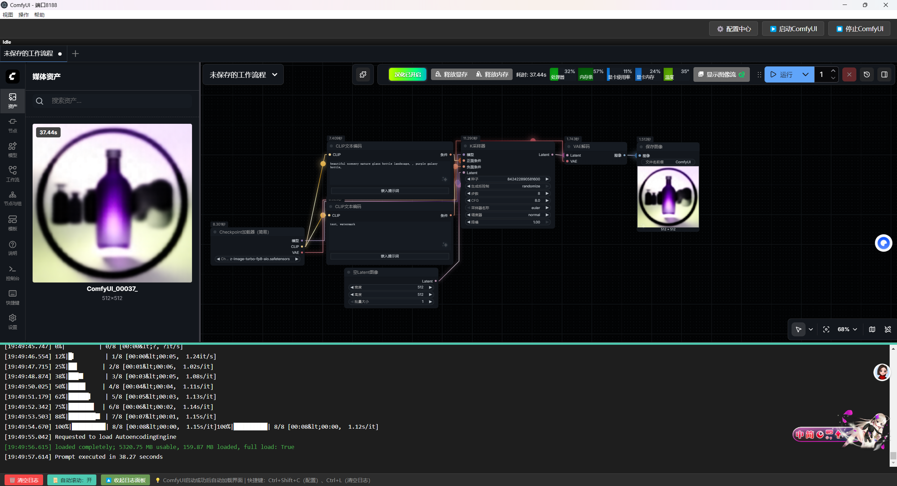

&nbsp;ComfyUI\_Electron启动器

让便携包confyui像Windows程序一样使用。

一款开箱即用的ComfyUI一键启动器，自带日志监控、进程管理、端口自动清理，无需手动配置环境。

适合感觉用浏览器打开confyui麻烦的人，感觉浏览器在查找东西时候打开多个窗口，再找回confyui界面麻烦的。
这是我用ai生成的，可能有不少问题，有能力又有想法的大佬可以拿去修改玩。

\## 📥 下载

\- 最新版本：\[Releases](https://github.com/ruolishipian/ComfyUI_Electron/releases)

\- 可选包类型：

&nbsp; - 安装包：`ComfyUI启动器 Setup x.x.x.exe`（双击安装）

&nbsp; - 绿色包：`ComfyUI启动器-x.x.x-win.zip`（解压即用）

\## 🚀 使用步骤

1\. 下载后，安装包双击安装，绿色包解压到任意目录；

2\. 运行`ComfyUI启动器.exe`；

3\. 首次启动点击「配置中心」，选择Python路径（python.exe）和ComfyUI目录（含main.py）；

4\. 点击「启动ComfyUI」，成功后自动加载ComfyUI界面；

5\. 关闭时自动清理进程和端口，无需手动操作。

\## ⚙️ 功能特性

\- ✅ 实时日志（区分错误/警告/信息）

\- ✅ 自动清理占用端口的进程

\- ✅ 启动成功后自动加载ComfyUI界面

\- ✅ 支持代理配置、自定义启动参数

\- ✅ 自动申请管理员权限（解决端口清理权限问题）

功能优化
1. 资源分配优化
优化了启动器的资源使用，将更多GPU资源留给ComfyUI
添加了手动视图切换功能（日志视图和ComfyUI视图）
2. 性能优化
保留了性能参数的用户自定义功能
移除了自动添加性能参数的逻辑，让用户通过配置界面自行添加
3. 界面优化
修复了iframe加载机制
改进了视图切换逻辑
添加了加载状态指示和错误处理

\## 📄 许可证

本项目基于MIT协议开源，详见\[LICENSE](LICENSE)文件。

